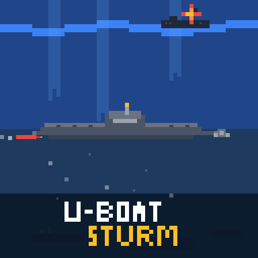

# U-BOAT STURM

## Overview

**U-BOAT STURM** is a 2D submarine simulation game developed with [Phaser 3](https://phaser.io/) and [React](https://react.dev/). The player takes control of a U-boat, facing enemies and managing resources like battery and torpedoes.

## Features

-   **Submarine Control:**
    -   **Throttle:** Control the submarine's speed using a throttle lever.
    -   **Rudder:** Control the submarine's direction.
    -   **Keyboard:** Use the arrow keys to control the submarine.
-   **Operation Modes:**
    -   **Surface:** Faster movement and battery recharging.
    -   **Dive:** Slower movement and battery consumption.
-   **Combat:**
    -   **Torpedoes:** Launch torpedoes to sink enemy ships.
    -   **Enemies:** Face corvettes patrolling the area.
-   **Interface:**
    -   **Battery Meter:** Monitor the submarine's battery level.
    -   **Action Buttons:** Buttons to fire torpedoes and to dive/surface.

## Technologies

-   **Game Framework:** [Phaser 3](https://phaser.io/)
-   **UI Library:** [React](https://react.dev/)
-   **Language:** JavaScript
-   **Bundler:** [Vite](https://vitejs.dev/)

## License

U-BOAT STURM is licensed under the GPLv3.

This program is free software: you can redistribute it and/or modify it under the terms of the GNU General Public License as published by the Free Software Foundation, either version 3 of the License, or (at your option) any later version.

This program is distributed in the hope that it will be useful, but WITHOUT ANY WARRANTY; without even the implied warranty of MERCHANTABILITY or FITNESS FOR A PARTICULAR PURPOSE. See the GNU General Public License for more details.

You should have received a copy of the GNU General Public License along with this program. If not, see http://www.gnu.org/licenses/.
